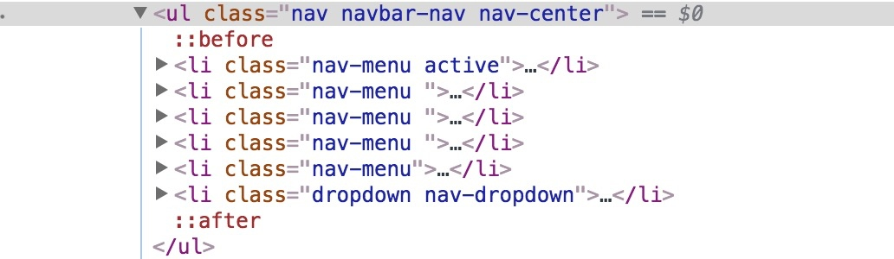

任务是制作一个在线简历。重点是语义化。
[简历地址](https://codepen.io/lzcdev/pen/GdqoRe)

#### HTML 是什么，HTML5 是什么
HTML 是一种用来描述网页的**标记语言**，而不是编程语言，HTML 语言是一套**标记标签**。比如说 XML 也是一种标记语言，而 Java 就是一种编程语言。HTML5 是下一代 HTML 标准，也就是 HTML 的升级版，增加了很多特性。比如：
- 用于绘画的 canvas 元素
- 用于媒介回放的 video 和 audio 元素
- 对本地离线存储的更好的支持
- 新的特殊内容元素，比如 article、footer、header、nav、section
- 新的表单控件，比如 calendar、date、time、email、url、search

#### HTML 元素标签、属性都是什么概念？
举个例子，`<p>`是一个标签，而`<p>内容</p>`这就是一个元素。也就是说元素由一个开始的标签和结束的标签组成。注意一下`<br />`，因为它本身既是开始标签也是结束标签，但不包含任何内容，所以这只是个标签。 为HTML元素提供各种附加信息的就是HTML属性，它总是以"属性名=属性值"这种键值对的形式出现，而且属性总是在HTML元素的开始标签中进行定义。 比如说`<p class="content">`，其中`class="content"`就是一个属性。

#### 文档类型是什么概念，起什么作用？
英文Document Type Definition，简写为DTD。由于历史的原因，浏览器对页面的渲染方式是不一样的，在W3C标准出来之前，浏览器对页面的渲染没有统一的标准，产生了差异，quirks mod（混杂模式或者兼容模式），但在W3C标准出台之后，浏览器对页面的渲染有了统一的标准即（严格模式或标准模式）。也就是说老的网页必须用老的模式，而新的网页一般都是用新的模式。为了让你的网页可以正常渲染，需要指定一下用哪种模式渲染。比如说常见的
```
<!DOCTYPE html>
```

#### meta标签都用来做什么的？
`<meta>` 可提供有关页面的元信息，比如关键字，最后修改日期，和其它的元数据。这些元数据将服务于浏览器（如何布局或重载页面），搜索引擎和其它网络服务。类似下面这样
```html
<meta charset="utf-8">
<meta http-equiv="X-UA-Compatible" content="IE=edge,chrome=1">
<meta name="renderer" content="webkit">
<meta name="viewport" content="width=device-width, initial-scale=1, maximum-scale=1, minimum-scale=1, user-scalable=no">
<meta name="format-detection" content="telephone=no">
<meta name="apple-mobile-web-app-capable" content="yes">
<meta name="keywords" content="百度, 百度前端, 百度前端学院, 百度前端技术学院, 前端, 前端开发, web前端, 前端开发工程师, CSS, JavaScript, HTML, Web标准">
<meta name="description" content="百度前端技术学院是面向大学生的前端技术学习平台，由百度创办的免费前端技术学习实践、交流、分享平台">
```
#### Web语义化是什么，是为了解决什么问题
语意化简单来说就是**描述内容的含义(meaning)**，比如说`<p>`标签是段落的意思，那么`<div>`标签是什么意思呢？现在很多人很喜欢用`<div>`这个标签，特别是对于新手，感觉大部分情况都可以用`<div>`标签搞定。但是对于开发者来说通过这个标签是无法知道它描述的是什么内容。当然不是说`<div>`标签不好，因为总有一些情况下你无法用语义话的标签描述它，这时候用`<div>`也无可厚非。所以用一句话来概括语义化就是**为了统一规范与新功能的出现**。

#### 链接是什么概念，对应什么标签？
用于从一个页面链接到另一个页面。对应的是`<a>`标签，比如：
```html
<a href="http://ife.baidu.com/">百度前端技术学院</a>
```
####  常用标签都有哪些，都适合用在什么场景
div标签用于组合其他HTML元素，本身无实在意义
h1~h6, p, span, strong, em..此类标签用于设置文本
ul, li, ol, dl, dt, dd 此类标签用于设置带有列表内容的
form 表单
table 表格
img, canvas 图像显示
a 标签用于打开链接，发送邮件，段落跳转等功能

####  表单标签都有哪些，对应着什么功能，都有哪些属性
| 标签 | 描述 | 属性 |
|:----:|:-------|:------|
|form|定义供用户输入的表单||
|input|定义输入框||
|form|定义文本区域（多行）||
|textarea|定义供用户输入的表单||
|label|定义一个控制的标签||
|button|定义一个按钮||
|select|定义一个选择列表||
|option|定义一个选项组||

####  ol, ul, li, dl, dd, dt等这些标签都适合用在什么地方，举个例子
用于设置带有列表内容的。比如百度前端技术学院首页的这几个分类。



