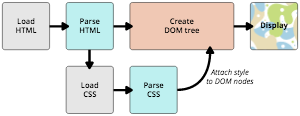

[简历地址](https://codepen.io/lzcdev/pen/GdqoRe)

#### 什么是CSS，CSS是如何工作的
CSS是一种用于向用户指定文档如何呈现的语言 — 它们如何被指定样式、布局等。 说白了就是用来样式化和排版你的网页的。浏览器将 HTML 和 CSS 转化成 DOM （文档对象模型）。DOM在计算机内存中表示文档。它把文档内容和其样式结合在一起。然后浏览器显示 DOM 的内容。

#### CSS的基本语法是怎样的
CSS是由两块内容组合而成的。即属性：属性值
- 属性（Propertie）：一些人类可理解的标识符，这些标识符指出你想修改哪一些样式，例如：字体，宽度，背景颜色等。
- 属性值（Value）：每个指定的属性都需要给定一个值，这个值表示你想把那些样式特征修改成什么样，例如，你想把字体，宽度或背景颜色改成什么

#### CSS选择器是什么概念，简单选择器和属性选择器是什么
选择器用于定位我们想要样式化的网页HTML 元素。各种各样可用的CSS选择器允许我们精确选择要样式化的元素。即选择器是帮我们定位哪个标签的。

简单选择器（Simple selectors）：通过元素类型、class 或 id 匹配一个或多个元素

属性选择器（Attribute selectors）：通过 属性 / 属性值 匹配一个或多个元素
#### 文本样式都有哪些相关属性，对应哪些值
- 字体
    - 颜色（color）
    - 字体种类（ font-family）
    - 字体大小（ font-size）
    - 字体样式（font-style），字体粗细（font-weight），文本转换（text-transform），文本装饰（text-decoration）
    - 文字阴影 (text-shadow)
- 文本布局
    - 文本对齐 （text-align）
    - 行高（line-height）
    - 字母和字间距（letter-spacing 和 word-spacing）
